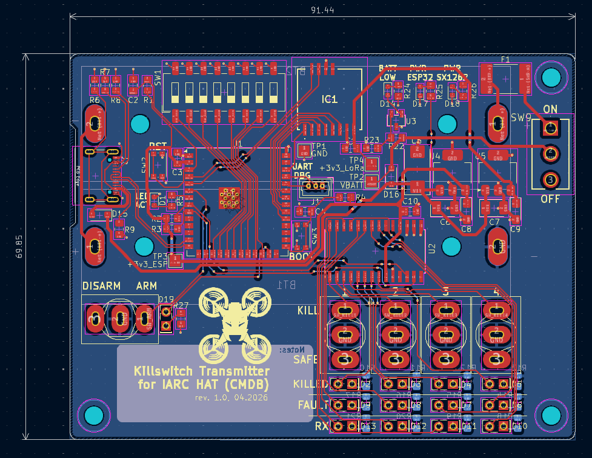
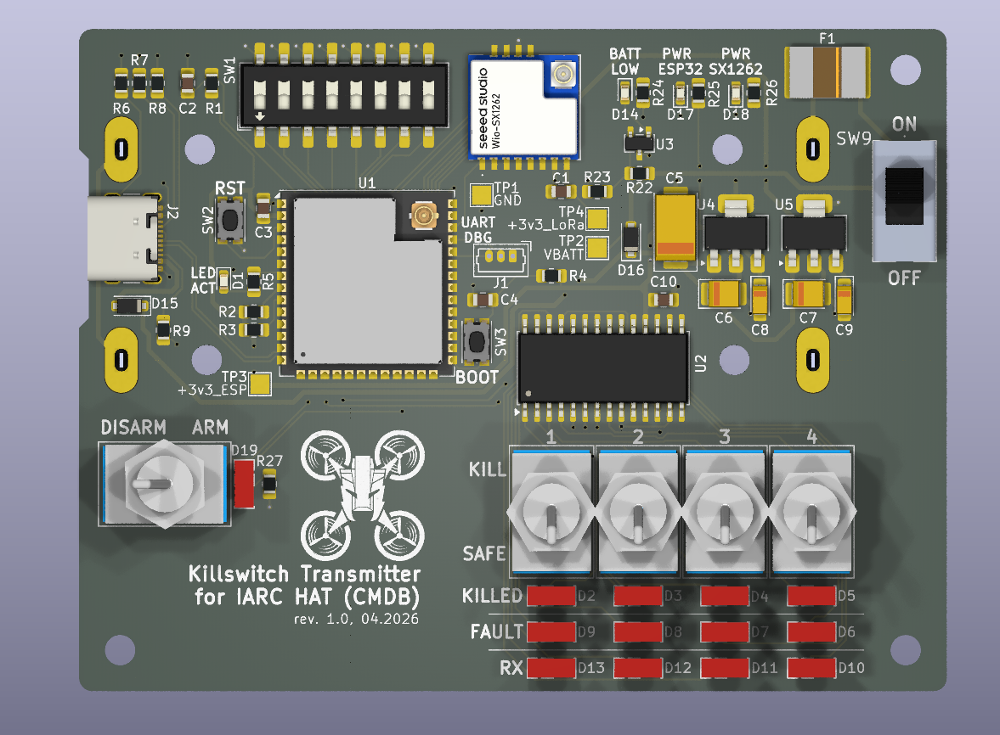
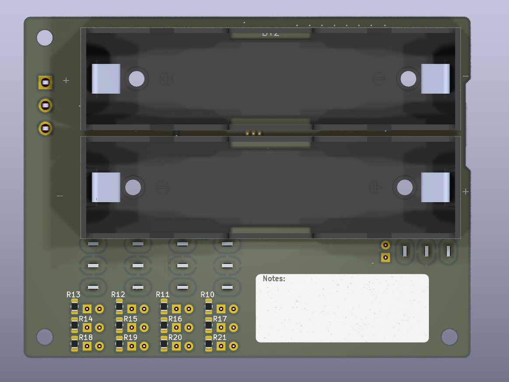

# Killswitch for IARC Hat for CMDB
## PCB Design

Board layout:

3D render:

## Usage
- Broadcast killing signal for drones using IARC CMDB hat or other LoRa-based killswitch
- Serve as LoRa packet grabber (by connecting to PC through UART

Board can be powered either from 2x 18650 cells or directly from USB-C (if host provides enough power).
No built-in undervoltage protection circuit is present, except for a warning LED.

## Authors
- Szymon Konopka (PCB Design)
- Piotr Kądziela (schematic design and PCB review) 